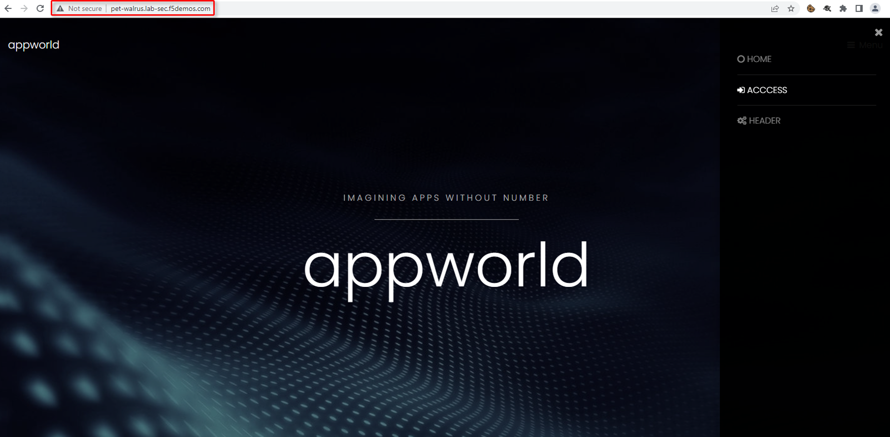
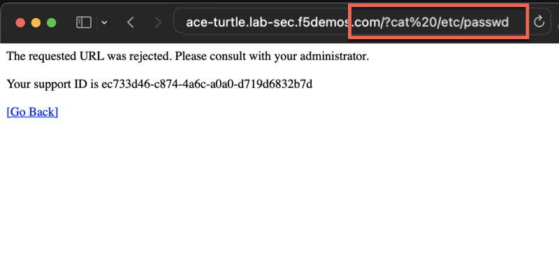
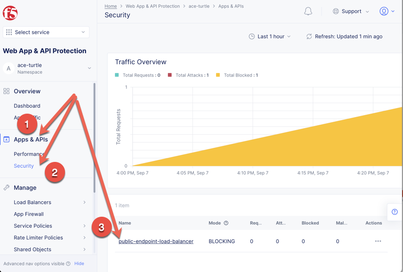
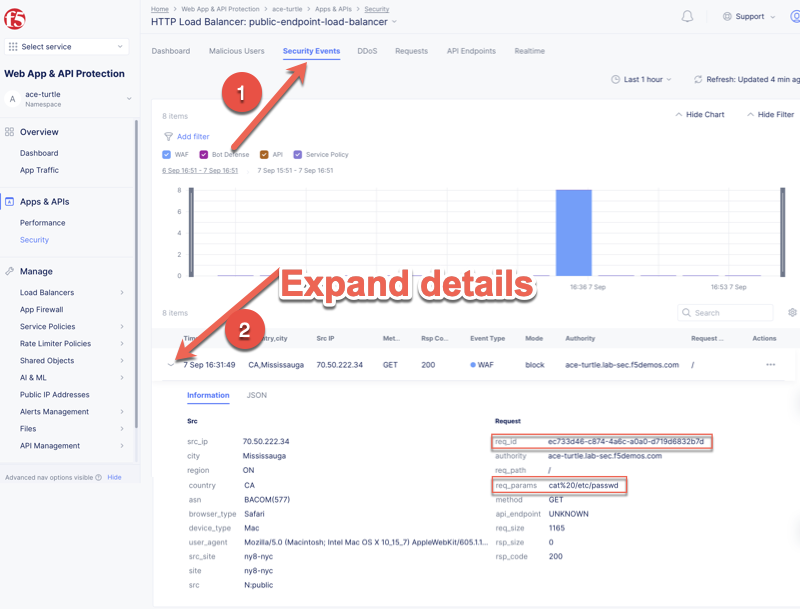

WAF Configuration
=================

Protecting applications requires the creation a WAF policy and attaching it to an HTTP/HTTPS load balancer.

Prerequisites
-------------

Prior to creating an HTTP load balancer, create a *WAF policy*, *Health Monitor*, and an *Origin Pool*.

Policy
^^^^^^^^^^

#. Select the ``Web App & API Protection`` section from the Home screen.

   .. image:: images/app-context.png
      :width: 100%
  
#. Select the assigned namespace.

   .. image:: images/namespace-selection.png
      :width: 100%

#. Navigate to ``Manage`` > ``App Firewall``, and click ``Add App Firewall``

   .. image:: images/add-app-firewall.png
      :width: 100%

#. Name the policy *blocking-app-firewall*, select ``Blocking`` as the ``Enforcement Mode``, and click the |save-and-exit| button at the bottom right.

   .. image:: images/app-firewall-create-save-exit.png
      :width: 100%

Health Check
^^^^^^^^^^^^

#. Navigate to ``Manage`` > ``Load Balancers`` > ``Health Checks``, and click ``Add Health Check``

   .. image:: images/add-health-check.png
      :width: 100%

#. Name the health-check "http-health-check", and click |save-and-exit|

   .. image:: images/add-health-check-save-and-exit.png
      :width: 100%

Origin Pool
^^^^^^^^^^^

#. Navigate to ``Manage`` > ``Load Balancers`` > ``Origin Pools``, and select ``Add Origin Pool``

   .. image:: images/add-origin-pool.png
      :width: 100%

#. Name the origin-pool "public-orgin-pool", and under "Origin Servers" click |add-item|

   .. image:: images/add-origin-pool-add-item.png
      :width: 100%

#. Set "Type of Origin Server" to "Public DNS Name of Origin Server", set the "DNS Name" to "demo-app.amer.myedgedemo.com" and click |apply|

   .. note:: A DNS value is used to resolve the IP address of the web server in the origin pool

   .. image:: images/add-origin-pool-add-public-server.png
      :width: 100%

#. Set the "Port" value to "80", and click |add-item| under "Health Checks"

   .. image:: images/add-origin-pool-add-item-health-check.png
      :width: 100%

#. After clicking |add-item| under "Health Checks", associate the "http-health-check", and click |save-and-exit|

   .. image:: images/add-origin-pool-add-item-health-check-save-and-exit.png
      :width: 100%

HTTP Load Balancer
--------------------

Creation
^^^^^^^^

#. Navigate to ``Manage`` > ``Load Balancers`` > ``HTTP Load Balancers`` and click ``Add HTTP Load Balancer``.

   .. image:: images/add-http-load-balancers.png
      :width: 100%

#. Create the http-load-balancer as follows:

   * Name: **public-endpoint-load-balancer**
   * Domains and LB Type: **<assigned-namespace>.lab-sec.f5demos.com**
   * Load Balancer Type: **HTTP (port 80)**
   * Automatically Manage DNS Records: **Checked**
   * Origins: **public-origin-pool**
   * Web Application Firewall (WAAP): **Enable and select "blocking-app-firewall"**
   * At the bottom of the page click |save-and-exit|

   .. image:: images/public-endpoint-http-load-balancer-save-and-exit.png
      :width: 100%

Testing Site
^^^^^^^^^^^^

After the HTTP Load Balancer has been created, use a browser to access the site:

http://<assigned-namespace>.lab-sec.f5demos.com

Craft a Violation
^^^^^^^^^^^^^^^^^

Append an invalid string ``/?cat%20/etc/passwd`` to the URL to view a blocking page.

Scripted Attack
^^^^^^^^^^^^^^^

https://test-tool.sr.f5-demo.com

Monitoring Dashboard
--------------------

Click ``Apps & APIs`` > ``security``, and select the public-endpoint-load-balancer.

Event Viewing
^^^^^^^^^^^^^

Click ``Security Events`` and expand the violation details.

Event Search
^^^^^^^^^^^^

#. Click ``Add Filter``

   .. image:: images/add-filter.png
      :width: 100%

#. Scroll to and select ``req_id``

   .. image:: images/select-req-id.png
      :width: 100%

#. Click the ``In`` operator.

   .. image:: images/click-in-operator.png
      :width: 100%

#. Paste the Support ID of the violation and click ``Assign a custom value(S)`` and click |apply|

   .. image:: images/assign-custom-value.png
      :width: 100%

#. Expand the details of the search result and view details.

   .. image:: images/search-results.png
      :width: 100%

